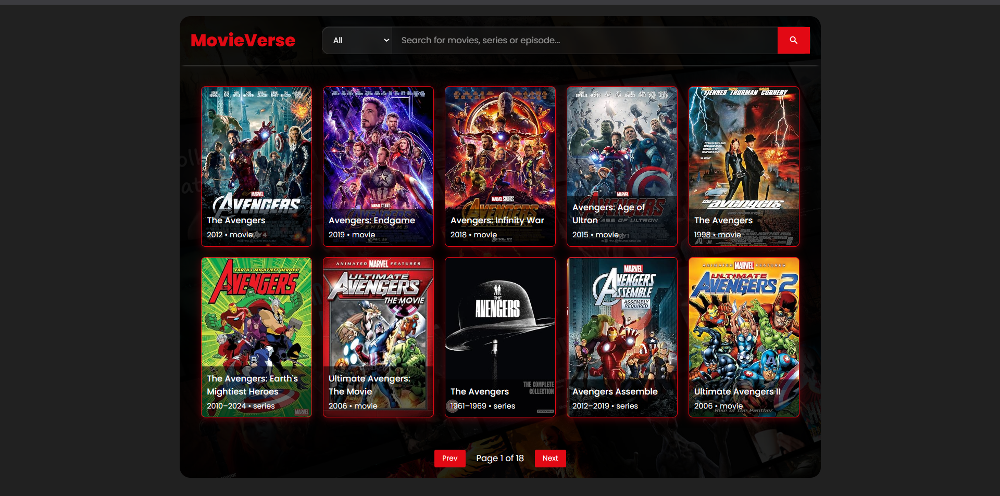
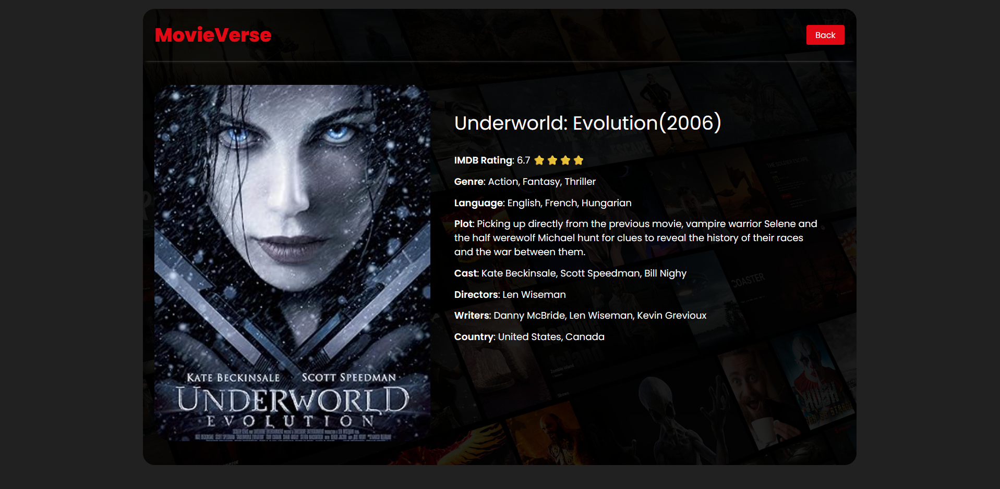

# 🎬 MovieVerse — Movie Search Web App

MovieVerse is a lightweight movie search web application built using vanilla JavaScript and the OMDb API. It allows users to search for movies, view suggestions in real-time, and explore detailed information about any selected movie.

---

## 🚀 Features

- 🔍 **Live Movie Search**
  - Search movies by title
  - Debounced input to reduce API calls

- 💡 **Search Suggestions**
  - Dynamic dropdown suggestions while typing
  - Quick access to relevant results

- 🎞️ **Movie Detail Page**
  - Displays full movie information:
    - Title, Year
    - IMDb Rating
    - Genre, Language
    - Plot
    - Cast, Director, Writers
    - Country

- 🔗 **Dynamic Routing**
  - Uses `imdbID` via URL query parameters
  - Example: `movie-detail.html?imdbID=tt1234567`

- 🖼️ **Poster Handling**
  - Handles missing/broken images
  - Displays fallback image when poster is unavailable

- ⚠️ **Error Handling**
  - Graceful UI for “Movie Not Found”
  - Redirects user back to home page

- ⏳ **Loading State**
  - Displays loader while fetching data

---

## 🧠 Tech Stack

- HTML5  
- CSS3  
- JavaScript (ES6+)  
- OMDb API  

---

## 📂 Project Structure

```

MovieSearchApp/
│
├── assets/
│   ├── movie-home-preview.png
│   ├── movie-detail-preview.png
│   ├── no-poster-avail.png
│
├── css/
│   ├── main.css
│   ├── movie-detail.css
│
├── js/
│   ├── main.js
│   ├── home.js
│   ├── movie-detail.js
│
├── index.html
├── movie-detail.html
└── README.md

````

---

## 🖥️ Screenshots

### 🏠 Home Page



---

### 🎬 Movie Detail Page



---

## ⚙️ How It Works

1. User types a movie name  
2. Debounced function triggers API call  
3. Suggestions appear dynamically  
4. User selects a movie  
5. App navigates to detail page with `imdbID`  
6. Movie data is fetched and rendered  

---


## 🌐 API Used

* OMDb API
  [https://www.omdbapi.com/](https://www.omdbapi.com/)

---

## 📈 What I Learned

* Event-driven JavaScript architecture
* Debouncing API calls
* Managing UI state (loading, success, error)
* Working with query parameters
* DOM manipulation vs data flow separation
* Handling asynchronous operations

---

## 🚧 Future Improvements

* Better mobile UX for search suggestions
* Add favorites/watchlist feature
* Pagination improvements
* Improve accessibility

---

## 📌 Notes

This project is built as a **learning-focused web application**, emphasizing core JavaScript concepts and real-world data handling.

---

## 🙌 Acknowledgement

Thanks to OMDb API for providing movie data.

---

## 📬 Contact

Feel free to connect or provide feedback!

